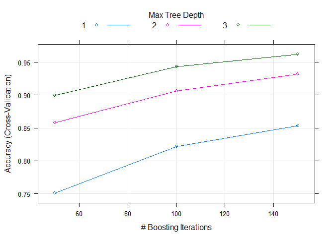

# Qualitative Activity Recognition of Weight Lifting Exercises
Ajnas Mujthabha K  
November 11, 2017  


## Introduction 

Using devices such as Jawbone Up, Nike FuelBand, and Fitbit it is now possible to collect a large amount of data about personal activity relatively inexpensively. These type of devices are part of the quantified self movement - a group of enthusiasts who take measurements about themselves regularly to improve their health, to find patterns in their behavior, or because they are tech geeks. One thing that people regularly do is quantify how much of a particular activity they do, but they rarely quantify how well they do it. The goal of this project will be to use data from accelerometers on the belt, forearm, arm, and dumbell of 6 participants who were asked to perform barbell lifts correctly and incorrectly in 5 different ways. 

## About the data

The training data for this project are available here: https://d396qusza40orc.cloudfront.net/predmachlearn/pml-training.csv  

The test data are available here: https://d396qusza40orc.cloudfront.net/predmachlearn/pml-testing.csv  

The data for this project come from this source: http://groupware.les.inf.puc-rio.br/har  

Six young health participants were asked to perform one set of 10 repetitions of the Unilateral Dumbbell Biceps Curl in five different fashions,
A. Exaclty according to the specifications  
B. Throwing elboes to the front  
C. Lifting the dumbbell only halfway  
D. Lowering the dumbbell only halfway  
E. Throwing the hips to the front

Class A corresponds to the specified execution of the excercise while the other 4 classes corresponds to the most common mistakes.

## Analysis

### Reading the data
  

```r
## Dowloading the data
if(!file.exists("pml-training.csv")){
        download.file(url = "https://d396qusza40orc.cloudfront.net/predmachlearn/pml-training.csv",
                      destfile ="pml-training.csv" )
}

if(!file.exists("pml-testing.csv")){
        download.file(url = "https://d396qusza40orc.cloudfront.net/predmachlearn/pml-testing.csv",
                      destfile ="pml-testing.csv" )
}

## Reading Data
wle <- read.csv("pml-training.csv", na.strings = c("","NA","#DIV/0!"))
test <- read.csv("pml-testing.csv", na.strings = c("","NA","#DIV/0!"))
dim(wle)
```

```
## [1] 19622   160
```
  
### Data Processing

Some of the preprocessing and transformations to be done on the data includes removing the first column (which is just the row number), every column with more than 50% NA values, the time stamps and intervals. For this project, only the raw reading from the different detectors are taken. Numerical Values are standardised using preProcess() function in caret package  


```r
## Cleaning Data
wle <- wle[,-1] #row number
test <- test[,-1]

# Selecting predictors with less than 50% NA values
nonNAcols <- colSums(is.na(wle)) < 0.5*19622
wle <- wle[,nonNAcols]
test <- test[,nonNAcols]

# Removing time stamps and window numbers
wle <-wle[,-c(1:6)]
test <- test[,-c(1:6)]

## Preprocessing
processing <- preProcess(wle[,-53],method = c('center','scale'))
processdata <- predict(processing,wle[,-53])
processdata$classe <- wle$classe
wle <- processdata
rm(processdata) # To save memory space

pretest <- predict(processing,test[,-53])
pretest$problem_id <- test$problem_id
test <- pretest
rm(pretest) # To save memory space
```
  
### Data Slicing

`wle` is split into a training and validation sets for validating the prediction model.  


```r
## Splittin Data into two parts
set.seed(123)
index <- createDataPartition(wle$classe,p = 0.8,list = FALSE)
train <- wle[index,]
valid <- wle[-index,]

rm(wle) # To save memory space
```
  
### Model Building

A gradient boosting model is used in this project, since it is one of the most popular and accurate machine learning methods available. `caret` package is used to fine tune the parameters.  


```r
## Training with gradient boosting
fitControl <- trainControl(
        method = "cv",
        number = 10
)
gbmfit <- train(classe~., 
                data=train, 
                trControl = fitControl, 
                method = "gbm",
                verbose = FALSE)

gbmfit
```

```
## Stochastic Gradient Boosting 
## 
## 15699 samples
##    52 predictor
##     5 classes: 'A', 'B', 'C', 'D', 'E' 
## 
## No pre-processing
## Resampling: Cross-Validated (10 fold) 
## Summary of sample sizes: 14130, 14129, 14130, 14130, 14129, 14128, ... 
## Resampling results across tuning parameters:
## 
##   interaction.depth  n.trees  Accuracy   Kappa    
##   1                   50      0.7506226  0.6837008
##   1                  100      0.8217722  0.7744385
##   1                  150      0.8533671  0.8144434
##   2                   50      0.8576356  0.8196420
##   2                  100      0.9060457  0.8811158
##   2                  150      0.9317148  0.9135994
##   3                   50      0.8997396  0.8730820
##   3                  100      0.9434353  0.9284317
##   3                  150      0.9624180  0.9524552
## 
## Tuning parameter 'shrinkage' was held constant at a value of 0.1
## 
## Tuning parameter 'n.minobsinnode' was held constant at a value of 10
## Accuracy was used to select the optimal model using  the largest value.
## The final values used for the model were n.trees = 150,
##  interaction.depth = 3, shrinkage = 0.1 and n.minobsinnode = 10.
```

```r
plot(gbmfit)
```

<!-- -->
  
### Cross Validation Testing
Let's check the accuraty of the final fit by predicting the classes in the validation set.  


```r
confusionMatrix(predict(gbmfit,valid[,-53]), valid[,53])
```

```
## Confusion Matrix and Statistics
## 
##           Reference
## Prediction    A    B    C    D    E
##          A 1097   26    0    0    3
##          B   12  713   20    6    5
##          C    5   18  652   21    5
##          D    1    0   11  611    8
##          E    1    2    1    5  700
## 
## Overall Statistics
##                                           
##                Accuracy : 0.9618          
##                  95% CI : (0.9553, 0.9675)
##     No Information Rate : 0.2845          
##     P-Value [Acc > NIR] : < 2.2e-16       
##                                           
##                   Kappa : 0.9516          
##  Mcnemar's Test P-Value : 0.003696        
## 
## Statistics by Class:
## 
##                      Class: A Class: B Class: C Class: D Class: E
## Sensitivity            0.9830   0.9394   0.9532   0.9502   0.9709
## Specificity            0.9897   0.9864   0.9849   0.9939   0.9972
## Pos Pred Value         0.9742   0.9431   0.9301   0.9683   0.9873
## Neg Pred Value         0.9932   0.9855   0.9901   0.9903   0.9935
## Prevalence             0.2845   0.1935   0.1744   0.1639   0.1838
## Detection Rate         0.2796   0.1817   0.1662   0.1557   0.1784
## Detection Prevalence   0.2870   0.1927   0.1787   0.1608   0.1807
## Balanced Accuracy      0.9863   0.9629   0.9690   0.9721   0.9840
```
  
The model shows 96.18% accuracy.  

## Prediction

The `test` data is already cleaned and processed along with train data. The “problem id” column wouldn't be required for predicting since it just names the problem.  


```r
data.frame(Problem_ID = test[,53],Prediction = predict(gbmfit,test[,-53]))
```

```
##    Problem_ID Prediction
## 1           1          B
## 2           2          A
## 3           3          B
## 4           4          A
## 5           5          A
## 6           6          E
## 7           7          D
## 8           8          B
## 9           9          A
## 10         10          A
## 11         11          B
## 12         12          C
## 13         13          B
## 14         14          A
## 15         15          E
## 16         16          E
## 17         17          A
## 18         18          B
## 19         19          B
## 20         20          B
```
